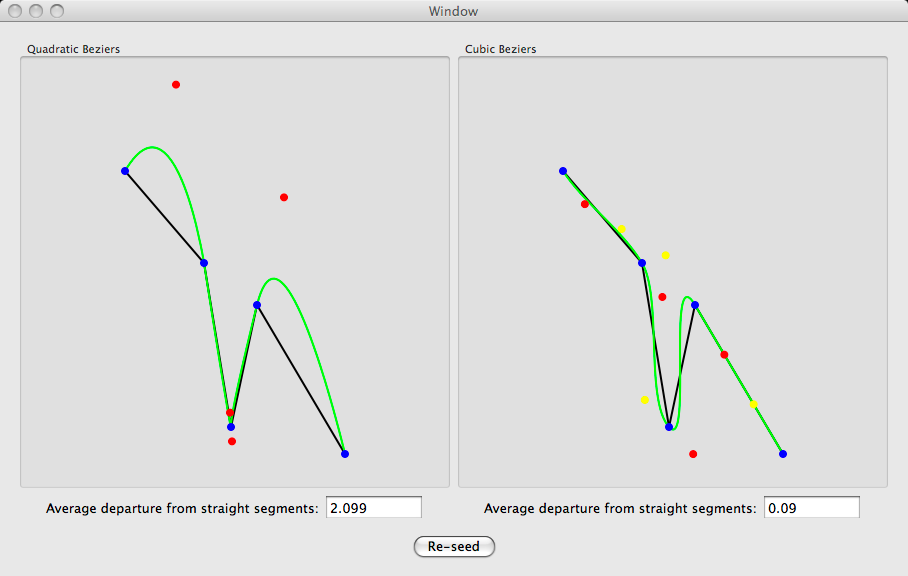

# Smoothing Line Segments

At one point, someone in the [cocoa-dev mailing list](https://lists.apple.com/mailman/listinfo/cocoa-dev) asked for an algorithm to draw a smooth curve passing through a number of given points. I solved the problem mathematically, then wrote a small application implementing the algorithm. The algorithm involves interpolating the points using [_Bezier curves_](http://en.wikipedia.org/wiki/Bézier_curve).

Originally written on July 2, 2007.

## License

I'm sharing this work under the [Creative Commons Attribution-ShareAlike 4.0 International (CC BY-SA 4.0)](http://creativecommons.org/licenses/by-sa/4.0/) license. See the LICENSE file for more information.
